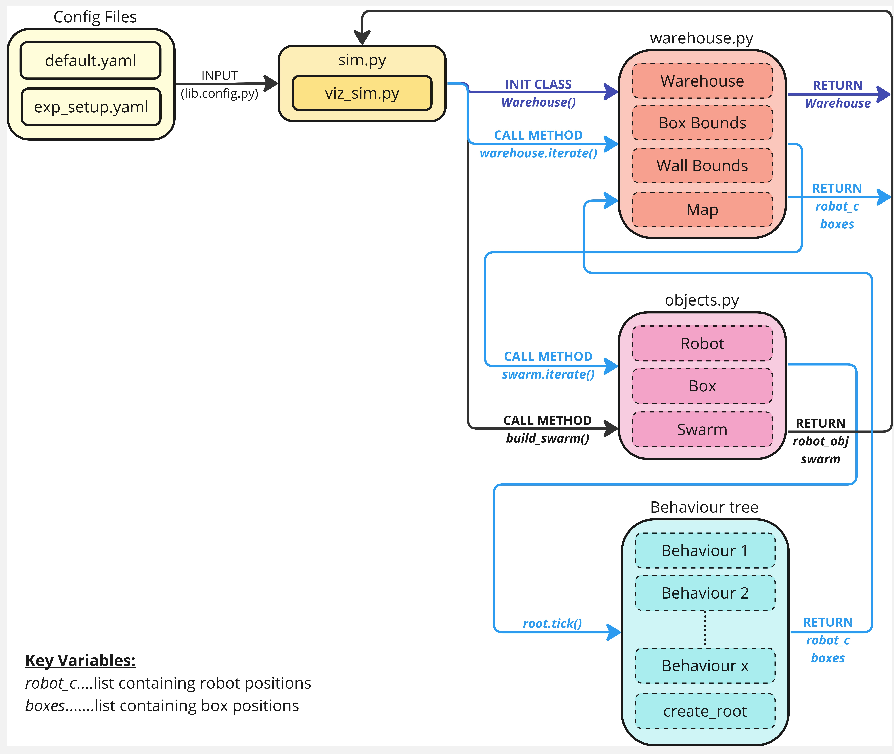

# DOTS 2D Simulator - Python

This simulator is designed to be used as a basic experimentation and setup tool for the DOTS robots. It allows users to test behaviour based controllers on robots at high speed and with basic physics.

This simulator is based on previous project work which can be found here: https://bitbucket.org/suet_lee/metric_extraction_ddmefd/src/master/

## Installation

Install the simulator by simply cloning this repository. Note that some dependent libraries will need to be installed. All code is written in Python.

## Documentation

### Overview
This simulator has been built for use with behaviour tree controllers. The main branch currently includes one example, a random walk. Other branches in this directory may contain more extensive conrtrollers that other users have developed for their own research.

The system works through a series of global lists which store the location of all robots (rob_c), the walls (wallsh, wallsv) and the location of all boxes (boxes). The simulator is initiated in the Simulator class which sets up the warehouse and swarm. The warehouse is madeup of the pre-defined walls and contains the locations of robots and boxes for plotting. The Swarm class is made up of x number of Robot classes. 

Each Robot object hosts a behaviour tree controller, in the implementation in main, these are homogeneous. Behaviour trees have a storage feature called 'Blackboard', this is used as a type of memory for each robot to store information about themselves and the other objects in the warehouse. The robot's sensors are artificially simualted by comparing the robot's own position against the position of others. The position of others (robots, walls, boxes) are all stored in each robot's blackboard making it easy and quick to compare locations locally, as if the robot was using sensors. Each robot's blackboard is updates on each iteration so that the positions of others stay up to date.

### Running the simulation
To run the simulation, simply navigate to the 'run_files', select a python run file from within, and run.

### Modifying the general simulation parameters
To make generalised changes to the simulation, the config files (cfg folder) can be modified. See the Confg Files table below for more info.

### Modifying the Swarm Behaviours 
Behaviour trees are currently implemented using the PyTrees library. This is very well documented here: https://py-trees.readthedocs.io/en/devel/

Users are encouraged to create new or modify existing behaviour trees for their own simulations using the same structure given in this repo. The behaviour tree can be split into multiple files as long as the root of the tree is called in the same way.

### File structure
The object-oriented approach of this simulator means that there is an interlinking relationship between different objects in the file structure. The diagram below gives and overview as to how each part fits together.

#### Run Files (simulator)
| Simulator File | Description                                                                                |
|----------------|--------------------------------------------------------------------------------------------|
| run_no_viz.py  | Runs the simulation headless with no vizualiser                                            |
| run_viz.py     | Runs with vizualiser                                                                       |

#### Simulator Files (simulator)
| Simulator File | Description                                                                                |
|----------------|--------------------------------------------------------------------------------------------|
| bt_random_walk | Random walk behaviour tree                                                                 |
| bt_setup.py    | File convention setup for behaviour trees                                                  |
| faults.py      | Used for fault analysis only                                                               |
| objects.py     | Contains the classes for all objects (robots, swarm and boxes)                             |
| sim.py         | Contains the classes and functions for running the simulator                               |
| viz_sim.py     | Contains the classes and functions for running the simulator with matplotlib visualisation |
| warehouse.py   | Contains the classes and functions for settup up the warehouse                             |

#### Config Files (cfg)

| Config File    | Description                                                          |
|----------------|----------------------------------------------------------------------|
| default.yaml   | Sets up the general parameters of the simulation including:          |
|                | - robot parameters (size, speed, sensor range)                       |
|                | - warehouse parameters (size, physics, object size)                  |
|                | - simulator parameters (timeout, save options)                       |
| exp_setup.yaml | Sets up the specific experimental parameters for each run including: |
|                | - number of agents                                                   |
|                | - beheviour tree controller                                          |
|                | - object setup                                                       |
|                | - tolerances                                                         |
| map.yaml       | Sets up the walls for the maps:                                      |
|                | - these are currently split into vertical and horizontal walls       |
|                | - use a nested list format to enter start and end point of each wall |

#### Library Files (lib)

| Library File | Description                                                   |
|-------------|----------------------------------------------------------------|
| Config.py   | Functions for parsing the config files into useable parameters |

## Contributing

Contributions are always welcome!

As every user is likely to have a slightly different simulation setup, we encourage users to create a branch for their own use. If you develop a new behaviour tree that may be useful to others, we can add it to the examples or keep it as an aptly named seperate branch.

Enjoy!
